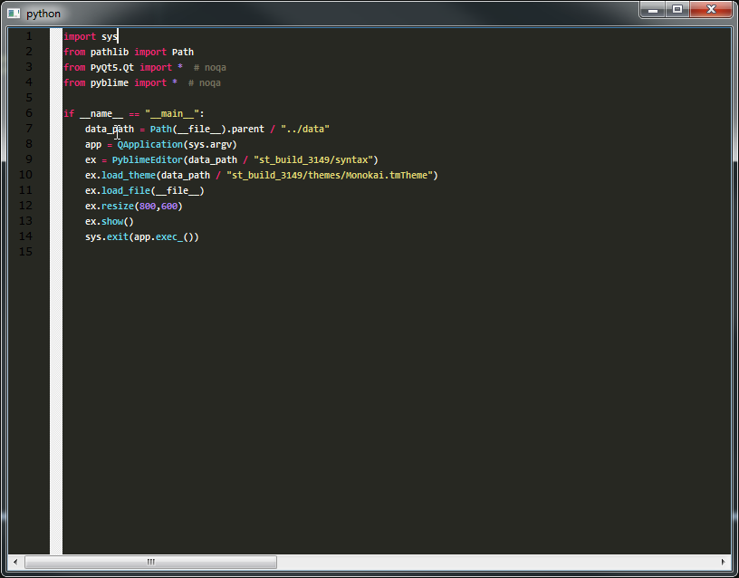

## pyblime

Standalone text editor widget for Pythonists that love Qt & SublimeText!!!

# Screenshots

# Why should you use pyblime?

- Do you want to create a python IDE?
- Do you to create a python tool that needs powerful text editing?
- Do you want to add a fancy graphical loggers to your existing project?

...

If that's so, this project is for you... pyblime is intended to become a powerful
text editor widget replacement for the pyqt/pyside2 builtin ones

# References/Credits

The following projects were used:

- [sublimetext](https://www.sublimetext.com) Target to emulate :)
- [syntect](https://github.com/trishume/syntect) Rust library for syntax highlighting using Sublime Text syntax definitions.
- [pyo3](https://github.com/PyO3/pyo3) Rust bindings for Python. Used to create the syntect python bindings
- [qscintilla](https://www.riverbankcomputing.com/software/qscintilla/intro) QScintilla is a port to Qt of Neil Hodgson's Scintilla C++ editor control.
- [scintilla](https://www.scintilla.org/) Used by QScintilla
- [pyqt](https://riverbankcomputing.com/software/pyqt/intro) PyQt brings together the Qt C++ cross-platform application framework and the cross-platform interpreted language Python.
